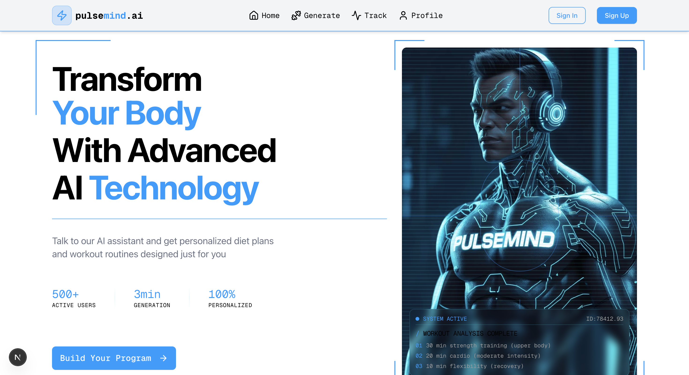

# PulseMind - AI Fitness Instructor



> Your personal AI-powered fitness companion. Transform your fitness journey with personalized workout plans, diet recommendations, and real-time AI coaching.

[](https://nextjs.org/)
[](https://reactjs.org/)
[](https://www.typescriptlang.org/)
[](https://tailwindcss.com/)

## Features

- **AI Voice Coach** - Interactive voice-powered AI assistant using Vapi for natural conversations
- **Personalized Workout Plans** - Custom exercise routines tailored to your fitness level and goals
- **Smart Diet Planning** - AI-generated meal plans with calorie tracking and nutritional guidance
- **Workout Tracking** - Monitor your progress and track completed workouts
- **User Profiles** - Comprehensive profile management with fitness program history
- **Secure Authentication** - Enterprise-grade security with Clerk authentication
- **Real-time Sync** - Convex-powered backend for instant data synchronization
- **Cyberpunk UI** - Modern, futuristic interface with smooth animations
- **Fully Responsive** - Optimized experience across desktop, tablet, and mobile devices
- **PDF Export** - Download your fitness plans as PDF documents

## Tech Stack

### Frontend
- **Framework**: Next.js 15.2.4 with App Router
- **Language**: TypeScript 5
- **Styling**: Tailwind CSS 4
- **UI Components**: Radix UI (Accordion, Dialog, Sheet, Tabs, Card, Button)
- **Icons**: Lucide React
- **PDF Generation**: jsPDF

### Backend & Services
- **Database**: Convex (serverless real-time backend)
- **Authentication**: Clerk
- **AI Services**: 
  - Google Generative AI (Gemini)
  - Vapi AI (voice interactions)
- **Webhooks**: Svix for secure webhook handling

### Development Tools
- **Build Tool**: Turbopack
- **Linting**: ESLint 9
- **Package Manager**: npm/yarn/pnpm

## Prerequisites

Ensure you have the following installed:
- Node.js 20.x or higher
- npm, yarn, or pnpm
- Git

## Quick Start

1. **Clone the repository**
   ```bash
   git clone https://github.com/nethal17/fitness-ai.git
   cd PulseMind-FitnessInstructor
   ```

2. **Install dependencies**
   ```bash
   npm install
   ```

3. **Environment Setup**
   
   Create a `.env.local` file in the root directory:
   ```env
   # Clerk Authentication
   NEXT_PUBLIC_CLERK_PUBLISHABLE_KEY=your_clerk_publishable_key
   CLERK_SECRET_KEY=your_clerk_secret_key
   NEXT_PUBLIC_CLERK_SIGN_IN_URL=/sign-in
   NEXT_PUBLIC_CLERK_SIGN_UP_URL=/sign-up
   
   # Convex Backend
   CONVEX_DEPLOYMENT=your_convex_deployment
   NEXT_PUBLIC_CONVEX_URL=your_convex_url
   
   # Google Generative AI
   GOOGLE_GENERATIVE_AI_API_KEY=your_google_ai_api_key
   
   # Vapi Voice AI
   NEXT_PUBLIC_VAPI_PUBLIC_KEY=your_vapi_public_key
   VAPI_PRIVATE_KEY=your_vapi_private_key
   ```

4. **Initialize Convex**
   ```bash
   npx convex dev
   ```

5. **Start development server**
   ```bash
   npm run dev
   ```

6. **Open your browser**
   
   Navigate to [http://localhost:3000](http://localhost:3000)

## Project Structure

```
PulseMind-FitnessInstructor/
├── src/
│   ├── app/                      # Next.js App Router
│   │   ├── (auth)/               # Auth group routes
│   │   │   ├── sign-in/          # Sign in page
│   │   │   └── sign-up/          # Sign up page
│   │   ├── generate-program/     # AI program generator
│   │   ├── profile/              # User profile dashboard
│   │   ├── workout-tracking/     # Workout tracking interface
│   │   ├── layout.tsx            # Root layout with providers
│   │   ├── page.tsx              # Homepage
│   │   └── globals.css           # Global styles & animations
│   ├── components/               # React components
│   │   ├── ui/                   # shadcn/ui components
│   │   │   ├── accordion.tsx
│   │   │   ├── button.tsx
│   │   │   ├── card.tsx
│   │   │   ├── dialog.tsx
│   │   │   ├── sheet.tsx
│   │   │   └── tabs.tsx
│   │   ├── CornerElements.tsx   # Decorative corner UI
│   │   ├── Footer.tsx           # Footer component
│   │   ├── Navbar.tsx           # Navigation bar
│   │   ├── NoFitnessPlan.tsx    # Empty state component
│   │   ├── ProfileHeader.tsx    # Profile header section
│   │   ├── TerminalOverlay.tsx  # Terminal-style overlay
│   │   └── UserPrograms.tsx     # User programs display
│   ├── constants/               # App-wide constants
│   │   └── index.ts
│   ├── lib/                     # Utility libraries
│   │   ├── pdfExport.ts         # PDF generation utilities
│   │   ├── utils.ts             # General utilities
│   │   └── vapi.ts              # Vapi client configuration
│   ├── providers/               # React context providers
│   │   └── ConvexClerkProvider.tsx
│   └── middleware.ts           # Next.js middleware
├── convex/                     # Convex backend
│   ├── _generated/             # Auto-generated Convex files
│   ├── auth.config.ts          # Clerk + Convex integration
│   ├── http.ts                 # HTTP endpoints
│   ├── plans.ts                # Fitness plans CRUD
│   ├── schema.ts               # Database schema
│   ├── users.ts                # User management
│   └── workouts.ts             # Workout operations
├── public/                     # Static assets
├── components.json             # shadcn/ui configuration
├── next.config.ts              # Next.js configuration
├── tailwind.config.js          # Tailwind CSS config
├── tsconfig.json               # TypeScript configuration
└── package.json                # Dependencies
```


## Key Features

### 1. AI-Powered Program Generation
- Natural language conversation with AI fitness coach
- Voice-enabled interactions via Vapi
- Generates comprehensive workout and diet plans
- Considers user's fitness level, goals, and preferences

### 2. Workout Tracking
- Track daily workout completion
- Monitor progress over time
- View detailed exercise information
- Mark workouts as complete

### 3. Profile Management
- View all fitness programs (active and archived)
- Toggle between different plans
- Access detailed workout schedules
- Review personalized diet recommendations
- Export plans to PDF

### 4. Secure Authentication
- Email/password authentication
- OAuth providers support
- Protected routes with middleware
- Session management

## Contributing

Contributions are welcome! Here's how you can help:

1. Fork the repository
2. Create a feature branch (`git checkout -b feature/AmazingFeature`)
3. Commit your changes (`git commit -m 'Add some AmazingFeature'`)
4. Push to the branch (`git push origin feature/AmazingFeature`)
5. Open a Pull Request

## Author

**Nethal Fernando**
- GitHub: [@nethal17](https://github.com/nethal17)
- Repository: [PulseMind-FitnessInstructor](https://github.com/nethal17/PulseMind-FitnessInstructor.git)

## Acknowledgments

- [Next.js](https://nextjs.org/) - The React framework
- [Clerk](https://clerk.com/) - Authentication & user management
- [Convex](https://convex.dev/) - Real-time backend platform
- [Google AI](https://ai.google.dev/) - Generative AI capabilities
- [Vapi](https://vapi.ai/) - Voice AI platform
- [Radix UI](https://www.radix-ui.com/) - Accessible component primitives
- [shadcn/ui](https://ui.shadcn.com/) - Beautiful UI components
- [Tailwind CSS](https://tailwindcss.com/) - Utility-first CSS framework

## License

This project is open source and available under the [MIT License](LICENSE).

## Support

For support, please:
- Open an issue on [GitHub](https://github.com/nethal17/fitness-ai/issues)
- Contact: your-email@example.com

---

**Your AI fitness revolution starts here | Nethal Fernando**
